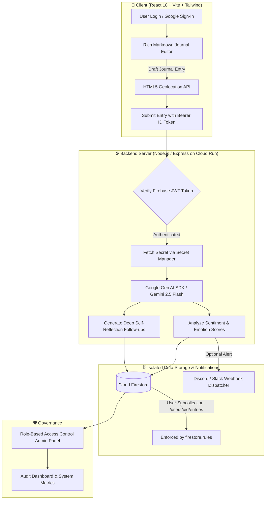

# 📔 MindReflect AI — Secure AI Journal on Google Cloud Run

<div align="center">

[](https://secure-ai-journal-app-br3843311-7472s-projects.vercel.app)
[](https://cloud.google.com/run)
[](https://cloud.google.com/vertex-ai)
[](https://react.dev/)
[](https://firebase.google.com/)
[](LICENSE)

<br>

**🏆 Official Submission for the Google Cloud Gen AI Academy APAC Edition Ideathon Challenge.**  
*A privacy-first, intelligent journaling application featuring real-time emotion scoring, contextual AI self-reflection prompts, and zero-trust user isolation.*

</div>

---

## 🌐 Live Demos & Links

- 🚀 **Live Interactive Web App**: [secure-ai-journal-app-br3843311-7472s-projects.vercel.app](https://secure-ai-journal-app-br3843311-7472s-projects.vercel.app)
- 📢 **Official Demo Video / Post**: [LinkedIn Post with #AccelerateAIwithCloudRun](https://lnkd.in/p/e9jNfGD2)
- 📦 **Source Code Repository**: [github.com/ranjithbrs/secure-ai-journal-app](https://github.com/ranjithbrs/secure-ai-journal-app)

---

## 📐 System Architecture & Data Flow



---

## ✨ Key Technical Highlights

1. **Gemini 2.5 Flash Cognitive Engine**:
   - Automated sentiment classification and multi-dimensional emotional breakdown (Joy, Optimism, Anxiety, Fatigue).
   - Generates contextual, open-ended introspective prompts tailored to the user's reflection history.
   - Interactive conversational companion ("MindReflect Companion") for exploring thoughts in real time.

2. **Zero-Trust Privacy & Security**:
   - Strict Firebase security rules (`firestore.rules`) ensure users can **only read and write their own documents** (`/users/{uid}/entries/{entryId}`).
   - Dynamic Google Cloud Secret Manager integration ensures `GEMINI_API_KEY` is loaded in-memory and never exposed to the client bundle.

3. **Cloud Native & Serverless**:
   - Containerized with Docker and optimized for **Google Cloud Run** deployment with the mandatory verification tag:
     ```bash
     --update-labels dev-tutorial=cloud-run-ai-challenge
     ```
   - Auto-scales from 0 to N instances on demand.

4. **Location-Aware Context**:
   - Optional geolocation capture tags entries with coordinates and city information to visualize personal memories on an interactive map.

---

## 📂 Project Structure

```text
secure-ai-journal-app/
├── server/
│   └── index.js              # Express API server, Gemini AI integration & auth middleware
├── src/
│   ├── components/           # React UI components (Editor, MoodTracker, MapView, Admin)
│   ├── context/              # Firebase Auth & Journal state management
│   ├── firebase.js           # Firebase Client SDK configuration
│   ├── App.jsx               # Application routing and view controllers
│   └── main.jsx              # React DOM entrypoint
├── firestore.rules           # Production security rules for Firestore
├── Dockerfile                # Multi-stage production container build
├── deploy-cloudrun.ps1       # PowerShell deployment script for Cloud Run
├── deploy-cloudrun.sh        # Shell deployment script for Linux / Cloud Shell
├── package.json              # Node.js dependencies and scripts
└── README.md                 # Project documentation
```

---

## 🚀 Local Development

### 1. Clone the repository
```bash
git clone https://github.com/ranjithbrs/secure-ai-journal-app.git
cd secure-ai-journal-app
npm install
```

### 2. Configure Environment (`.env`)
```env
PORT=8080
GEMINI_API_KEY=your_gemini_api_key
VITE_FIREBASE_API_KEY=your_firebase_api_key
VITE_FIREBASE_AUTH_DOMAIN=your_project.firebaseapp.com
VITE_FIREBASE_PROJECT_ID=your_project_id
```

### 3. Run Development Server
```bash
# Start Vite frontend
npm run dev

# In another terminal, start Express server
npm run server
```

---

## ☁️ Cloud Run Deployment Command

```bash
gcloud run deploy secure-ai-journal-app \
    --source . \
    --platform managed \
    --region us-central1 \
    --allow-unauthenticated \
    --update-labels dev-tutorial=cloud-run-ai-challenge
```

---

## 👨‍💻 Author

**Ranjith B**  
🎓 *B.Tech Computer Science & Business Systems (CSBS)*  
🏛️ *Nehru Institute of Engineering and Technology, Coimbatore*  

- 💼 **LinkedIn**: [linkedin.com/in/ranjith-b-85907831a](https://linkedin.com/in/ranjith-b-85907831a)  
- 🐙 **GitHub**: [github.com/ranjithbrs](https://github.com/ranjithbrs)  
- 🌐 **Portfolio**: [ranjithbrs.github.io/portfolio](https://ranjithbrs.github.io/portfolio/)  
- 📧 **Email**: ranjithb2k06@gmail.com  

---

## 📄 License

This project is licensed under the [MIT License](LICENSE).

